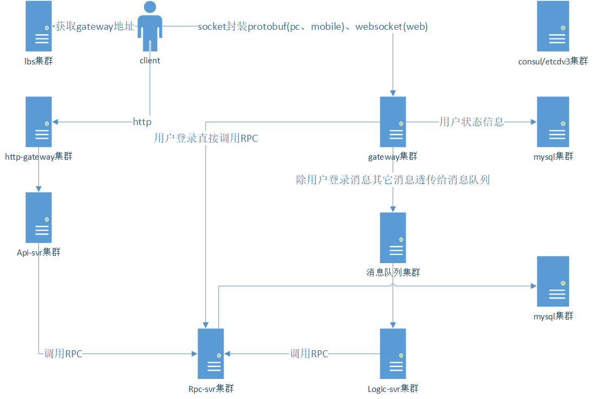
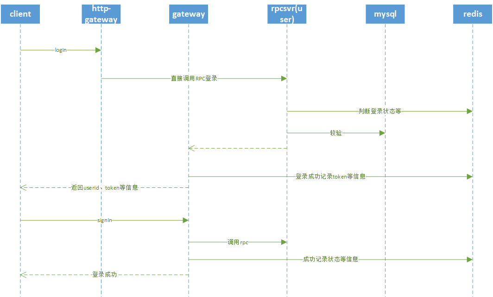
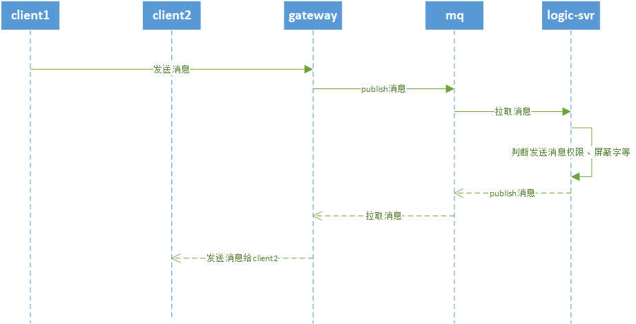
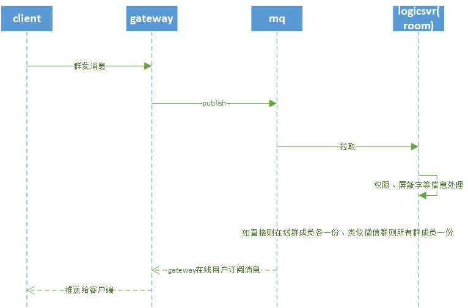

# my-micro
my-micro基于[micro](https://github.com/micro/micro)，编写微服务框架所使用到场景的例子。

# 系统架构
my-micro考虑了服务器应用的各个场景（IM、直播业务、电商皆可），客户端可通过http、websocket、socket(封装pb)与服务器通信。
目前仅完成通信的各种示例(仅验证可行性)，后面会慢慢完善。

## http-gateway
客户端http/https通信
## api-svr
见micro api示例
## gateway
客户端与服务端保持长连接，方便接收到系统通知或他人消息，通讯消息websocket或二进制封装protobuf
## 消息队列（mq）
这里以NSQ为例，客户端发给gateway的协议，除登录外，其它直接通过MQ透传
## logic-svr
订阅gateway的消息进行逻辑处理，可按具体业务分im-svr、room-svr按逻辑分，也可合在一起，建议分开，这里为测试，暂合在一起
## rpc-svr
供服务器内部RPC调用
## redis
用户状态等动态信息缓存，减轻服务器压力
## mysql
数据存储
## 其它服务
比如通知等，这里暂略，后续再添加
# 核心业务流程图(以IM、直播业务为例)
未考虑消息丢失、按顺序发送、离线消息等
## 登录业务序列图

## IM消息序列图

## 群发消息序列图

# 环境安装：
## 1.protobuf
[下载](https://github.com/protocolbuffers/protobuf/archive/v3.6.0.1.zip)或wget https://github.com/protocolbuffers/protobuf/archive/v3.6.0.1.zip
./autogen.sh && ./configure && make  
sudo make install    
sudo ldconfig  
## 2.protoc-gen-go
go get -u github.com/golang/protobuf/protoc-gen-go
## 3.protoc-gen-micro
go get github.com/micro/protoc-gen-micro
## 4.依赖环境安装启动(仅方便测试)
sudo apt-get install redis-server

# 测试
## 1. 运行consul、nsq、jaeger等
docker-compose up
## 2.启动rpcsvr
go run rpcsrv/user/main.go
## 3.启动逻辑服
go run logicsvr/main.go
## 4.启动gateway
go run srv/gateway/gateway.go
## 5.启动robot机器人进行登录发消息测试
go run robot/main.go

